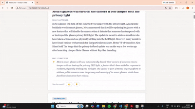

# NewsLens — Personalised News Explainer App

> Stay informed without the overwhelm. NewsLens fetches today's top news, ranks it by what you care about, and explains each story in plain language — what happened, why it matters, and the background you need to understand it.

---

## Demo




---

## What It Does

Most news apps give you headlines and expect you to figure out the rest. NewsLens explains the news like a well-read friend would:

- **Personalised** — select the topics you care about, see those articles first
- **Plain English** — every story explained in simple language, no jargon
- **Why it matters** — a specific, punchy 2-sentence insight written by an LLM
- **Background context** — Wikipedia-sourced context so you're never lost
- **Learns from you** — thumbs up/down reactions improve future rankings
- **Self-updating** — refreshes automatically every morning at 7 AM

---

## Architecture

```
RSS Feeds (10+ sources across 9 categories)
        ↓
news_collector.py     → fetch, deduplicate, date-filter articles
        ↓
personalizer.py       → TF-IDF + cosine similarity ranks by user interests
                        + feedback-weighted boost from reaction history
        ↓
categorizer.py        → hard rules first, then sentence-transformer embeddings
        ↓
ai_processor.py       → LexRank extractive summary
                        + Groq API (Llama 3.3 70B) "why it matters"
                        + Wikipedia background context
        ↓
app.py (Flask)        → SQLite cache + Jinja2 templates → personalised feed
```

**Per-request flow:**
1. User selects interest categories on the landing page
2. Flask saves preferences to SQLite, redirects to `/feed`
3. Pipeline fetches up to 20 articles per selected category from RSS
4. TF-IDF + feedback boosts rank all articles by relevance
5. Category balancing distributes slots proportionally (15–25 articles total)
6. For each article: full text fetched via newspaper3k, category classified, summaries generated
7. Results cached in SQLite — next visit loads instantly
8. APScheduler refreshes all feeds at 7:00 AM daily

---

## Tech Stack

| Layer | Technology | Purpose |
|---|---|---|
| Backend | Flask | Web server and routing |
| Data Collection | feedparser, newspaper3k | RSS parsing, full article text |
| Personalisation | scikit-learn (TF-IDF + cosine similarity) | Rank articles by user interest |
| Classification | sentence-transformers (all-MiniLM-L6-v2) | Semantic category matching via embeddings |
| Summarisation | sumy (LexRank) | Extractive key sentence selection |
| LLM | Groq API — Llama 3.3 70B | Generate "why it matters" context |
| Background | wikipedia-python | Background context per article |
| NLP | spaCy (en_core_web_sm) | POS tagging, NER, sentence segmentation |
| Storage | SQLite | User profiles, article cache, reaction history |
| Scheduling | APScheduler | Daily 7 AM pipeline refresh |

---

## Setup Instructions

### Prerequisites
- Python 3.10 or 3.11 recommended (3.13 has NLP library compatibility issues)
- A free [Groq API key](https://console.groq.com) — 14,400 requests/day free, no billing required

### 1. Clone the repository
```bash
git clone https://github.com/YOUR_USERNAME/newslens.git
cd newslens
```

### 2. Create and activate a virtual environment
```bash
# Windows
python -m venv venv
venv\Scripts\activate

# Mac / Linux
python -m venv venv
source venv/bin/activate
```

### 3. Install dependencies
```bash
pip install -r requirements.txt
python -m spacy download en_core_web_sm
python -m nltk.downloader punkt punkt_tab
```

### 4. Set up environment variables
Create a `.env` file in the project root:
```
GROQ_API_KEY=your_groq_api_key_here
FLASK_SECRET_KEY=any_random_string_here
```

Get your free Groq API key at [console.groq.com](https://console.groq.com).

### 5. Run the app
```bash
python app.py
```

Open `http://localhost:5000` in your browser.

> **First run note:** `sentence-transformers` downloads `all-MiniLM-L6-v2` (~80 MB) on first startup. This is a one-time download, cached locally after.

### 6. Using the app
1. Enter your name and select interest categories
2. Click **Build my feed**
3. Wait ~60–90 seconds for the first pipeline run (subsequent visits load from cache instantly)
4. React to articles with 👍 / 👎 — future runs will factor in your preferences
5. Force a fresh pipeline run: `http://localhost:5000/feed?refresh=1`

---

## Key ML/NLP Concepts

**TF-IDF Personalisation**
User interests become a query document. All fetched articles are vectorised using TF-IDF. Cosine similarity between the query vector and each article vector determines ranking — articles semantically close to what you care about score highest.

**Feedback-Weighted Ranking**
Thumbs up/down reactions are stored per article. The next pipeline run computes category and source boost multipliers from reaction history. Final score = `TF-IDF score × category_boost × source_boost`. This is implicit feedback learning — the system improves without requiring the user to reconfigure settings.

**Embedding-Based Classification**
Each category is described by a natural language sentence and embedded into a 384-dimensional vector using `all-MiniLM-L6-v2`. Incoming articles are embedded the same way and classified by finding the closest category vector via cosine similarity. Hard rules (unambiguous title patterns) run first for instant, free classification.

**LexRank Summarisation**
Represents the article as a sentence similarity graph — similar to PageRank but for sentences. The most "central" sentences (similar to many others) are extracted as the summary.

**Prompt Engineering**
The Groq prompt for "why it matters" went through 6+ iterations. Key techniques: persona anchoring, explicit prohibition of generic openers, concrete bad/good examples, hard sentence count limits, and conditional tone by article type.

---

## Project Status

Working prototype built as a portfolio project. Known limitations:
- Paywalled articles (e.g. The Hindu premium) fall back to RSS summary
- No persistent user accounts — preferences stored in browser session cookie
- Classification can miss on multi-domain articles (e.g. AI regulation in parliament)

---

## Author

Built by **[Your Name]**
[LinkedIn](https://linkedin.com/in/yourprofile) · [Email](mailto:you@email.com)
